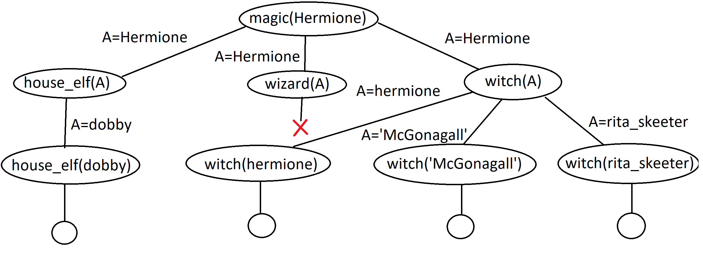

We are working with the following knowledge base:

```prolog
house_elf(dobby).
witch(hermione).
witch('McGonagall').
witch(rita_skeeter).
magic(X):-house_elf(X).
magic(X):-wizard(X).
magic(X):-witch(X).
```

Which of the following queries are satisfied? Where relevant, give all the variable
instantiations that lead to success.

1. ?- magic(house_elf).
   * **False** | house_elf is a complex term, not an atom.
2. ?- wizard(harry).
   * **False** | Unknown procedure: wizard/1
3. ?- magic(wizard).
   * **False** | Unknown procedure: wizard/1
4. ?- magic('McGonagall').
   * **True**
5. ?- magic(Hermione).
   1. Hermione = dobby
   2. Hermione = hermione
   3. Hermione = 'McGonagall'
   4. Hermione = rita_skeeter

Draw the search tree for the fifth query magic(Hermione).

