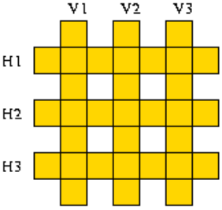
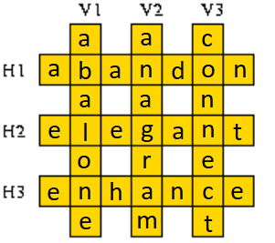
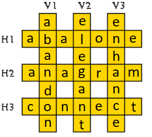

Here are six English words:

`abalone, abandon, anagram, connect, elegant, enhance.`

They are to be arranged in a crossword puzzle like fashion in the grid given
below.



The following knowledge base represents a lexicon containing these words.

```prolog
word(abalone,a,b,a,l,o,n,e).
word(abandon,a,b,a,n,d,o,n).
word(enhance,e,n,h,a,n,c,e).
word(anagram,a,n,a,g,r,a,m).
word(connect,c,o,n,n,e,c,t).
word(elegant,e,l,e,g,a,n,t).
```

Write a predicate crosswd/6 that tells us how to fill the grid, i.e. the first three
arguments should be the vertical words from left to right and the following three
arguments the horizontal words from top to bottom.

Script:
```prolog
% L --> Letter.
% Index --> The number of intersection of columns, from left to right from top to bottom.
crosswd(V1, V2, V3, H1, H2, H3) :-
    word(V1, _, L1, _, L4, _, L7, _),
    word(V2, _, L2, _, L5, _, L8, _),
    word(V3, _, L3, _, L6, _, L9, _),
    word(H1, _, L1, _, L2, _, L3, _),
    word(H2, _, L4, _, L5, _, L6, _),
    word(H3, _, L7, _, L8, _, L9, _).
```

Results:
```prolog
?- crosswd(V1, V2, V3, H1, H2, H3).
V1 = abalone,
V2 = anagram,
V3 = connect,
H1 = abandon,
H2 = elegant,
H3 = enhance ;

V1 = abandon,
V2 = elegant,
V3 = enhance,
H1 = abalone,
H2 = anagram,
H3 = connect ;

false.
```

So, there are only 2 options:

 <br>
