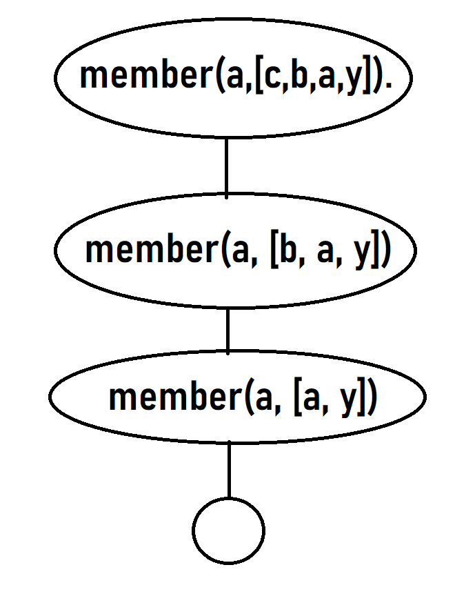
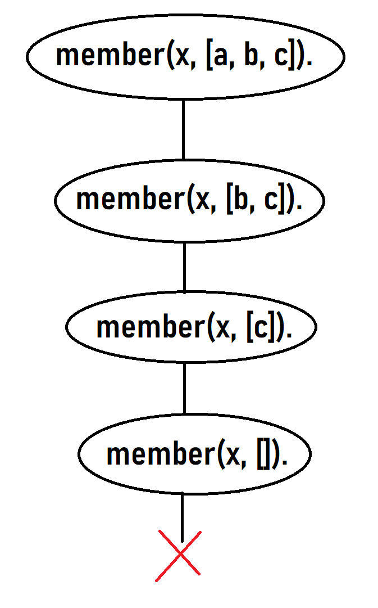
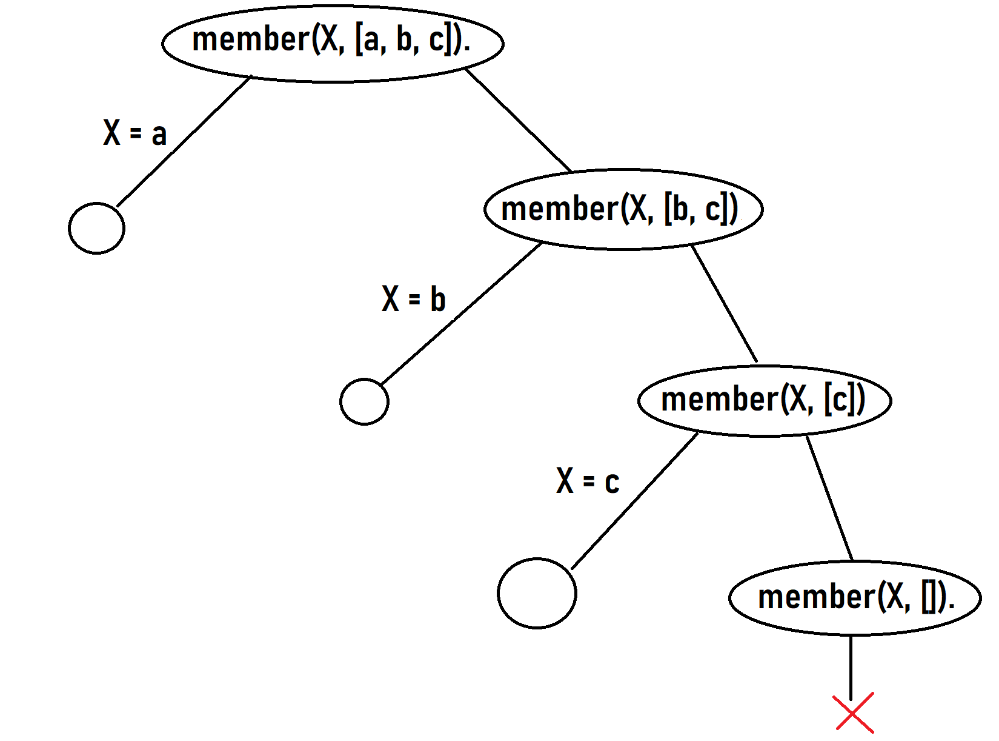

Draw the search trees for the following three queries:

```prolog
?- member(a, [c, b, a, y]).

?- member(x, [a, b, c]).

?- member(X, [a, b, c]).
```

---

First query:
```prolog
?- member(a, [c, b, a, y]).
```



Second query:
```prolog
?- member(x, [a, b, c]).
```



Third query:
```prolog
?- member(X, [a, b, c]).
```

