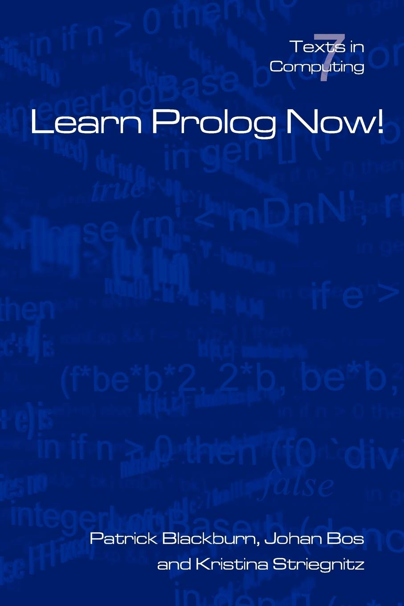

# "Learn Prolog Now!"
**by Patrick Blackburn, Johan Bos, and Kristina Striegnitz**<br>

<a href="#"></a>

Welcome to the "Learn Prolog Now!" Exercises Repository. This repository is dedicated to storing the code solutions and exercises completed while working through the "Learn Prolog Now!" book. Prolog is a powerful logic programming language, and this resource aims to help learners master its concepts and applications.

## About "Learn Prolog Now!"

"Learn Prolog Now!" is a comprehensive online course and textbook designed to teach Prolog programming from the basics to advanced topics. The book covers fundamental Prolog concepts, logical reasoning, and practical applications through a series of engaging exercises.

## Table of Contents
1. [Facts, Rules and Queries](./01-Facts-Rules-Queries/)
   - [Some simple examples](./01-Facts-Rules-Queries/01-Some-Simple-Examples/)
   - [Prolog Syntax](./01-Facts-Rules-Queries/02-Prolog-Syntax/)
   - [Exercises](./01-Facts-Rules-Queries/03-Exercises/)
   - [Practical Session 1](./01-Facts-Rules-Queries/04-Practical-Session-1/) 
2. [Matching and Proof Search](./02-Matching-Proof-Search/)
   - [Matching](./02-Matching-Proof-Search/01-Matching/)
   - [Proof Search](./02-Matching-Proof-Search/02-Proof-Search/)
   - [Exercises](./02-Matching-Proof-Search/03-Exercises/)
   - [Practical Session 2](./02-Matching-Proof-Search/04-Practical-Session-2/)
3. [Recursion](./03-Recursion/)
   - [Recursive definitions](./03-Recursion/01-Recursive-Definitions/)
   - [Clause ordering, goal ordering, and termination](./03-Recursion/02-Clause-Goal-Ordering-Termination/)
   - [Exercises](./03-Recursion/03-Exercises/)
   - [Practical Session 3](./03-Recursion/04-Practical-Session-3/)
4. [Lists](./04-Lists/)
   - [Lists](./04-Lists/01-Lists/)
   - [Member](./04-Lists/02-Member/)
   - [Recursing Down Lists](./04-Lists/03-Recursing-Down-Lists/)
   - [Exercises](./04-Lists/04-Exercises/)
   - [Practical Session 4](./04-Lists/05-Practical-Session-4/)
5. [Arithmetic](./05-Arithmetic/)
   - [Arithmetic in Prolog](./05-Arithmetic/01-Arithmetic-in-Prolog/)
   - [A closer look](./05-Arithmetic/02-A-Closer-Look/)
   - [Arithmetic and lists](./05-Arithmetic/03-Arithmetic-and-Lists/)
   - [Comparing integers](./05-Arithmetic/04-Comparing-Integers/)
   - [Exercises](./05-Arithmetic/05-Exercises/)
   - [Practical Session 5](./05-Arithmetic/06-Practical-Session-5/)
6. [More lists](./06-More-Lists/)
   - [Append](./06-More-Lists/01-Append/)
   - [Reversing a list](./06-More-Lists/02-Reversing-a-List/)
   - [Exercises](./06-More-Lists/03-Exercises/)
   - [Practical Session 6](./06-More-Lists/04-Practical-Session-6/)

## Important note!
I use the **SWI-Prolog** interpreter for this project.

## How to Use This Repository

1. **Clone the Repository**: Use the following command to clone this repository to your local machine. <br>
   ```sh
   git clone https://github.com/xairaven/Learn-Prolog-Now.git
   ```
   
2.  **Navigate to the Chapter**: Explore the folder of needed chapter and navigate to the task you are working on.
3. **Review Code and Solutions**: Open the Prolog code files to review the exercises. Compare your solutions with the provided.
4. **Contribute**: Feel free to contribute your solutions, improvements, or additional exercises by creating pull requests.

## How to Contribute

If you would like to contribute to this repository, follow these steps:

1. Fork the repository to your GitHub account.
2. Clone the forked repository to your local machine: <br>
    ```sh
    git clone https://github.com/xairaven/Learn-Prolog-Now.git
    ```
3. Create a new branch for your contributions: <br>
    ```sh
    git checkout -b feature/new-feature
    ```
4. Make your changes, add new exercises, or improve existing ones.
5. Commit your changes: <br>

    ```sh
    git commit -m "Add a brief description of your changes"
    ```
6. Push your changes to your forked repository: <br>
   ```sh
    git push origin feature/new-feature
    ```
7. Create a pull request on the main repository to merge your changes.

## Support and Discussions

If you have questions, encounter issues, or want to discuss Prolog concepts, feel free to open an issue in the repository. Collaboration and learning together is encouraged!

Happy Prolog coding!

---

**This repository is license free and redistributable.** <br>
**Not used commercially**